# THERAPi — System Design & Architecture

> **THERAPi** (AiTherapy / AIC) is a full-stack AI mental health companion: users authenticate, create therapy chat sessions, and converse with an AI therapist powered primarily by **Azure OpenAI Assistants API**, with optional **DeepSeek** integration.

---

## Table of Contents

1. [Executive Summary](#1-executive-summary)
2. [High-Level Architecture](#2-high-level-architecture)
3. [Component Architecture](#3-component-architecture)
4. [Deployment Architecture](#4-deployment-architecture)
5. [Data Architecture](#5-data-architecture)
6. [API Design](#6-api-design)
7. [Authentication & Security](#7-authentication--security)
8. [Core Flows (Sequence Diagrams)](#8-core-flows-sequence-diagrams)
9. [Frontend Architecture](#9-frontend-architecture)
10. [Backend Architecture](#10-backend-architecture)
11. [External Integrations](#11-external-integrations)
12. [Technology Stack](#12-technology-stack)
13. [Known Gaps & Future State](#13-known-gaps--future-state)

---

## 1. Executive Summary

| Aspect | Description |
|--------|-------------|
| **Product** | Web-based AI therapy chat with session management and planned monetization |
| **Users** | End users (`Role.User`) seeking mental health support |
| **Frontend** | Angular 19 SPA/SSR (`MainTherapi_Frontend/Therapi FrontEnd`) |
| **Backend** | ASP.NET Core 8 Web API (`MainTherapi_Backend/therapi/AiTherapy`) |
| **Database** | MySQL 8.x via Entity Framework Core (Pomelo provider) |
| **Primary AI** | Azure OpenAI — Assistants, Threads, Messages, Runs |
| **Secondary AI** | DeepSeek Chat Completions (anonymous endpoint) |
| **Auth** | JWT Bearer tokens (12-hour expiry) |

---

## 2. High-Level Architecture

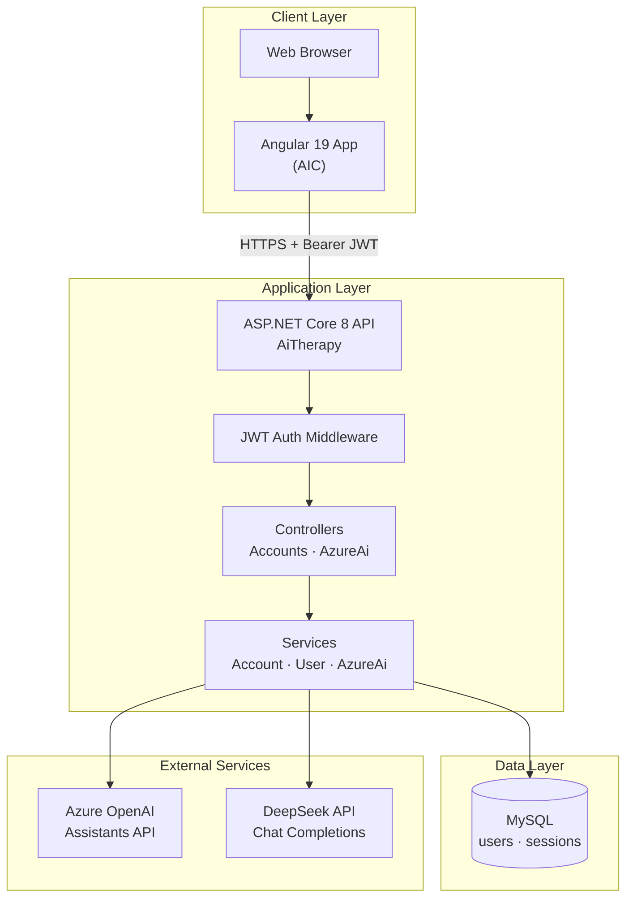
```mermaid
flowchart TB
    subgraph Client["Client Layer"]
        Browser["Web Browser"]
        Angular["Angular 19 App<br/>(AIC)"]
        Browser --> Angular
    end

    subgraph API["Application Layer"]
        Gateway["ASP.NET Core 8 API<br/>AiTherapy"]
        Auth["JWT Auth Middleware"]
        Controllers["Controllers<br/>Accounts · AzureAi"]
        Services["Services<br/>Account · User · AzureAi"]
        Gateway --> Auth --> Controllers --> Services
    end

    subgraph Data["Data Layer"]
        MySQL[("MySQL<br/>users · sessions")]
    end

    subgraph External["External Services"]
        AzureAI["Azure OpenAI<br/>Assistants API"]
        DeepSeek["DeepSeek API<br/>Chat Completions"]
    end

    Angular -->|"HTTPS + Bearer JWT"| Gateway
    Services --> MySQL
    Services --> AzureAI
    Services --> DeepSeek
```

### Layer Responsibilities

| Layer | Responsibility |
|-------|----------------|
| **Client** | UI, routing, auth state, OpenAPI-generated HTTP client, JWT interceptor |
| **API** | REST endpoints, business logic, AI orchestration, token issuance |
| **Data** | Persist users and session-to-thread mappings |
| **External** | LLM inference, thread/message storage (Azure-side) |

---

## 3. Component Architecture

### 3.1 Repository Structure

```
Main Therapi App/
├── MainTherapi_Backend/
│   └── therapi/
│       ├── AiTherapy.sln
│       └── AiTherapy/                 # ASP.NET Core Web API
│           ├── Controller/
│           ├── Services/
│           ├── IServices/
│           ├── Entities/
│           ├── Models/
│           ├── Migrations/
│           ├── Program.cs
│           └── Dockerfile
│
└── MainTherapi_Frontend/
    └── Therapi FrontEnd/              # Angular 19 application
        ├── src/app/
        │   ├── accounts/              # Login, Sign-up
        │   ├── chat/                  # Main therapy chat UI
        │   ├── home/                  # Landing page
        │   ├── purchase/              # Subscription UI (planned)
        │   ├── main/                  # Header, Side-nav
        │   ├── shared/                # Profile, Session create, Toast
        │   └── services/              # Auth, Chat, Session, Interceptors
        └── build/api/                 # OpenAPI-generated TypeScript client
```

### 3.2 Backend Component Diagram

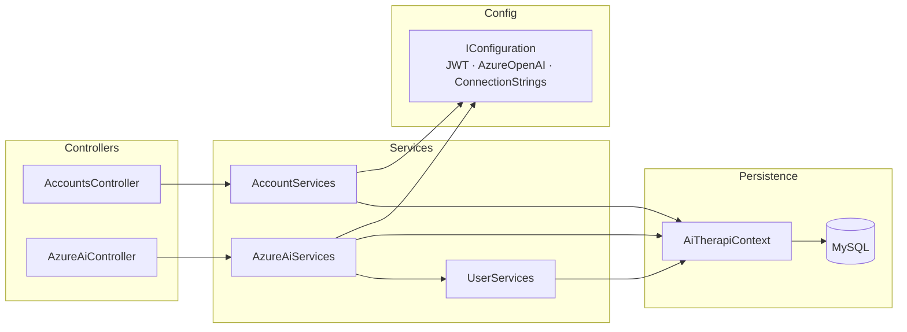
```mermaid
flowchart LR
    subgraph Controllers
        AC[AccountsController]
        AIC[AzureAiController]
    end

    subgraph Services
        AS[AccountServices]
        US[UserServices]
        AIS[AzureAiServices]
    end

    subgraph Persistence
        CTX[AiTherapiContext]
        DB[(MySQL)]
    end

    subgraph Config
        CFG[IConfiguration<br/>JWT · AzureOpenAI · ConnectionStrings]
    end

    AC --> AS
    AIC --> AIS
    AIS --> US
    AIS --> CTX
    AS --> CTX
    US --> CTX
    CTX --> DB
    AS --> CFG
    AIS --> CFG
```

### 3.3 Frontend Component Diagram

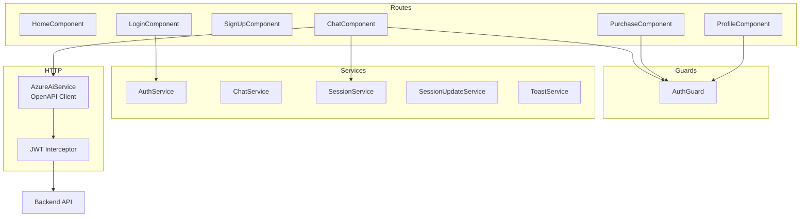
```mermaid
flowchart TB
    subgraph Routes
        Home[HomeComponent]
        Login[LoginComponent]
        SignUp[SignUpComponent]
        Chat[ChatComponent]
        Purchase[PurchaseComponent]
        Profile[ProfileComponent]
    end

    subgraph Guards
        AG[AuthGuard]
    end

    subgraph Services
        AuthS[AuthService]
        ChatS[ChatService]
        SessionS[SessionService]
        SessionUpd[SessionUpdateService]
        ToastS[ToastService]
    end

    subgraph HTTP
        JWT[JWT Interceptor]
        API[AzureAiService<br/>OpenAPI Client]
    end

    Chat --> AG
    Purchase --> AG
    Profile --> AG
    Chat --> SessionS
    Chat --> API
    Login --> AuthS
    API --> JWT
    JWT --> Backend["Backend API"]
```

---

## 4. Deployment Architecture

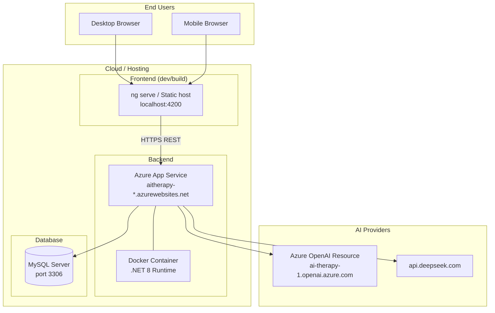
```mermaid
flowchart TB
    subgraph UserDevices["End Users"]
        Desktop["Desktop Browser"]
        Mobile["Mobile Browser"]
    end

    subgraph Hosting["Cloud / Hosting"]
        subgraph FrontendHost["Frontend (dev/build)"]
            NG["ng serve / Static host<br/>localhost:4200"]
        end

        subgraph BackendHost["Backend"]
            AzureApp["Azure App Service<br/>aitherapy-*.azurewebsites.net"]
            Docker["Docker Container<br/>.NET 8 Runtime"]
            AzureApp --- Docker
        end

        subgraph DatabaseHost["Database"]
            MySQLSrv[("MySQL Server<br/>port 3306")]
        end
    end

    subgraph AICloud["AI Providers"]
        AzureOAI["Azure OpenAI Resource<br/>ai-therapy-1.openai.azure.com"]
        DeepSeekAPI["api.deepseek.com"]
    end

    Desktop --> NG
    Mobile --> NG
    NG -->|"HTTPS REST"| AzureApp
    AzureApp --> MySQLSrv
    AzureApp --> AzureOAI
    AzureApp --> DeepSeekAPI
```

### Build & Deploy Artifacts

| Artifact | Tool | Output |
|----------|------|--------|
| Frontend | `ng build` | `dist/aic/` (browser + optional SSR server) |
| Backend | `dotnet publish` / Docker | `AiTherapy.dll` in container |
| API Client | `openapi-generator-cli` | `build/api/` TypeScript Angular SDK |

### Configuration Boundaries

| Setting | Location | Purpose |
|---------|----------|---------|
| `basePath` | `app.config.ts` | Backend API URL for OpenAPI client |
| `ConnectionStrings:DefaultConnection` | `appsettings.json` | MySQL connection |
| `AzureOpenAI:*` | `appsettings.json` | Endpoint, key, model |
| `JwtOptions:*` | `appsettings.json` | Token signing & validation |

> **Note:** Secrets should be moved to environment variables or a secret manager in production. Do not commit credentials to source control.

---

## 5. Data Architecture

### 5.1 Entity-Relationship Diagram

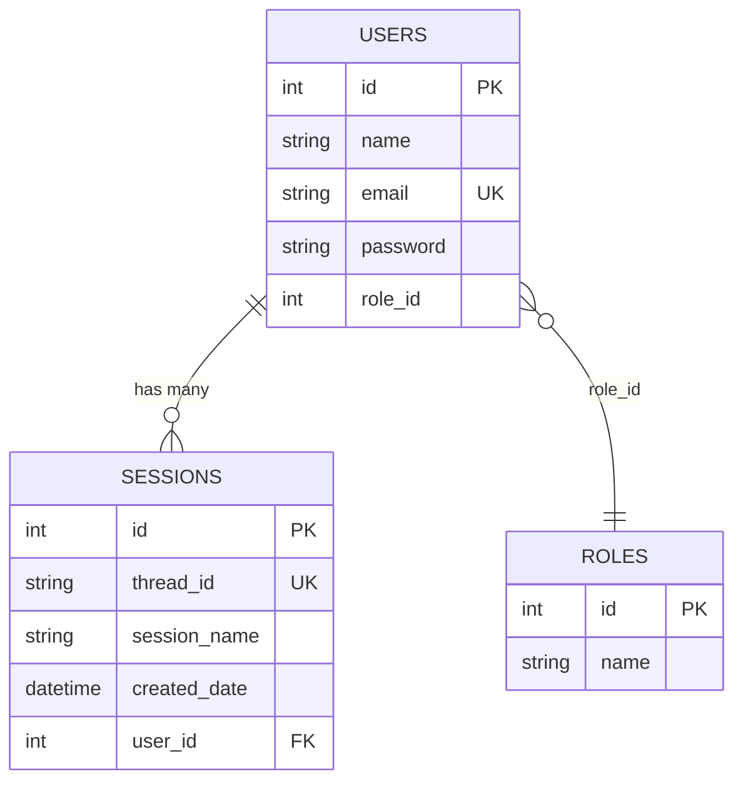
```mermaid
erDiagram
    USERS ||--o{ SESSIONS : "has many"

    USERS {
        int id PK
        string name
        string email UK
        string password
        int role_id
    }

    SESSIONS {
        int id PK
        string thread_id UK
        string session_name
        datetime created_date
        int user_id FK
    }

    ROLES {
        int id PK
        string name
    }

    USERS }o--|| ROLES : "role_id"
```

### 5.2 Table Definitions

#### `users`

| Column | Type | Notes |
|--------|------|-------|
| `id` | INT | Primary key, auto-increment |
| `name` | VARCHAR | Display name |
| `email` | VARCHAR | Unique login identifier |
| `password` | VARCHAR | AES-encrypted (custom Encipher/Decipher) |
| `role_id` | INT | Default: `1` (User) |

#### `sessions`

| Column | Type | Notes |
|--------|------|-------|
| `id` | INT | Primary key |
| `thread_id` | VARCHAR | Azure OpenAI thread ID |
| `session_name` | VARCHAR | User-visible session label |
| `created_date` | DATETIME | Session creation timestamp |
| `user_id` | INT | FK → `users.id` |

### 5.3 Data Ownership Split

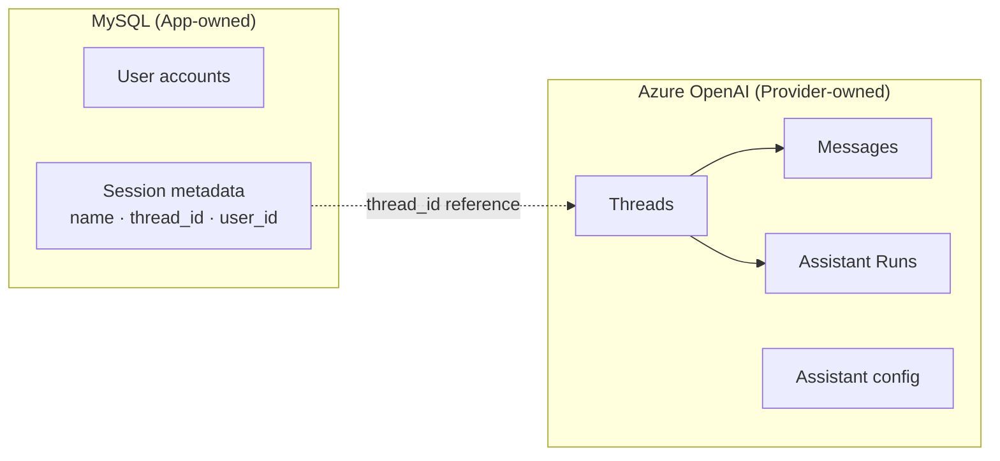
```mermaid
flowchart LR
    subgraph MySQL["MySQL (App-owned)"]
        U[User accounts]
        S[Session metadata<br/>name · thread_id · user_id]
    end

    subgraph Azure["Azure OpenAI (Provider-owned)"]
        T[Threads]
        M[Messages]
        R[Assistant Runs]
        A[Assistant config]
    end

    S -.->|"thread_id reference"| T
    T --> M
    T --> R
```

| Data | Stored In | Rationale |
|------|-----------|-----------|
| Credentials, profile | MySQL | App-controlled auth |
| Session list & names | MySQL | Fast per-user listing without Azure pagination |
| Chat messages | Azure OpenAI | Managed by Assistants API |
| AI responses | Azure OpenAI | Retrieved via thread messages API |

---

## 6. API Design

### 6.1 Endpoint Map

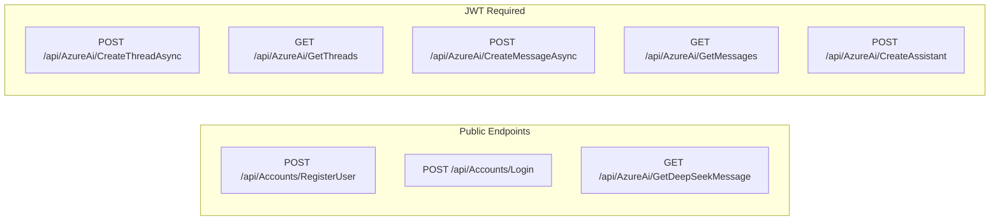
```mermaid
flowchart LR
    subgraph Public["Public Endpoints"]
        REG["POST /api/Accounts/RegisterUser"]
        LOG["POST /api/Accounts/Login"]
        DS["GET /api/AzureAi/GetDeepSeekMessage"]
    end

    subgraph Protected["JWT Required"]
        CT["POST /api/AzureAi/CreateThreadAsync"]
        GT["GET /api/AzureAi/GetThreads"]
        CM["POST /api/AzureAi/CreateMessageAsync"]
        GM["GET /api/AzureAi/GetMessages"]
        CA["POST /api/AzureAi/CreateAssistant"]
    end
```

### 6.2 API Reference

#### Accounts (`AccountsController`)

| Method | Route | Auth | Request | Response |
|--------|-------|------|---------|----------|
| POST | `/api/Accounts/RegisterUser` | None | `AccountsModel` (name, email, password) | `ApiResponse` |
| POST | `/api/Accounts/Login` | None | `AccountsModel` (email, password) | `ServiceResponse<LoginResponse>` |

**`LoginResponse` fields:** `userName`, `accessToken`, `expiresIn`, `tokenType`

#### Azure AI (`AzureAiController`)

| Method | Route | Auth | Parameters | Response |
|--------|-------|------|------------|----------|
| POST | `/api/AzureAi/CreateThreadAsync` | JWT | `name` (query) | `ThreadResponse` |
| GET | `/api/AzureAi/GetThreads` | JWT | — | `List<ThreadResponse>` |
| POST | `/api/AzureAi/CreateMessageAsync` | JWT | `threadId`, `messageContent` (query) | `List<MessageResponse>` |
| GET | `/api/AzureAi/GetMessages` | JWT | `threadId` (query) | `List<MessageResponse>` |
| POST | `/api/AzureAi/CreateAssistant` | JWT | `AssistantRequest` (body) | `string` (assistant id) |
| GET | `/api/AzureAi/GetDeepSeekMessage` | **None** | `userMessage` (query) | `DeepSeekResponse` |

### 6.3 DTO Shapes (Conceptual)

```
ThreadResponse
├── id: int          (DB session id)
├── name: string     (session_name)
├── threadId: string (Azure thread id)
└── createdDate: datetime

MessageResponse
├── role: string     ("user" | "assistant")
└── content: string
```

---

## 7. Authentication & Security

### 7.1 Auth Flow Overview

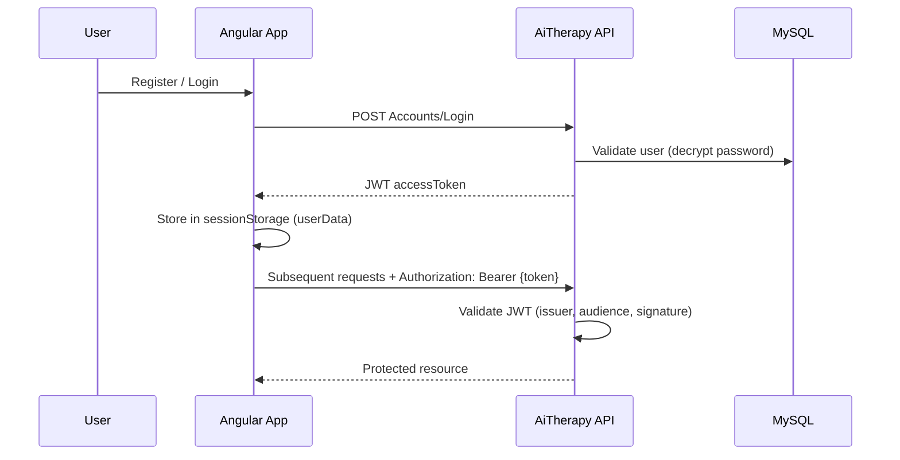
```mermaid
sequenceDiagram
    participant U as User
    participant FE as Angular App
    participant API as AiTherapy API
    participant DB as MySQL

    U->>FE: Register / Login
    FE->>API: POST Accounts/Login
    API->>DB: Validate user (decrypt password)
    API-->>FE: JWT accessToken
    FE->>FE: Store in sessionStorage (userData)
    FE->>API: Subsequent requests + Authorization: Bearer {token}
    API->>API: Validate JWT (issuer, audience, signature)
    API-->>FE: Protected resource
```

### 7.2 JWT Claims

| Claim | Value |
|-------|-------|
| `NameIdentifier` | User ID |
| `Name` | User display name |
| Expiry | 12 hours (UTC) |

### 7.3 Security Model (Current vs Recommended)

| Area | Current State | Production Recommendation |
|------|---------------|---------------------------|
| Password storage | Custom AES encryption | bcrypt / Argon2 via ASP.NET Identity |
| API keys | `appsettings.json` | Azure Key Vault / env vars |
| CORS | `AllowAnyOrigin` | Restrict to frontend origin |
| DeepSeek endpoint | `[AllowAnonymous]` | Require auth or remove |
| HTTPS | Redirect enabled | Enforce HSTS |
| Session limits | UI placeholders | Server-side quota enforcement |

---

## 8. Core Flows (Sequence Diagrams)

### 8.1 User Registration

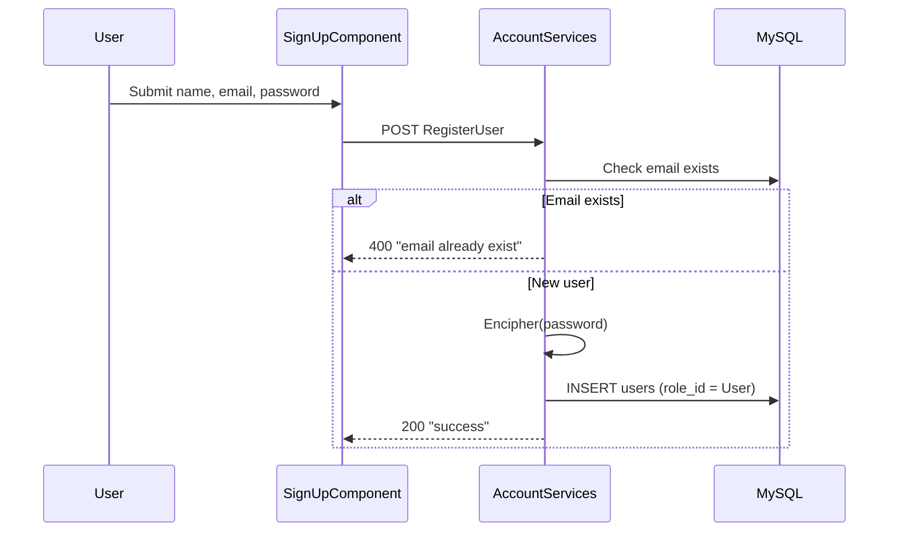
```mermaid
sequenceDiagram
    participant U as User
    participant FE as SignUpComponent
    participant API as AccountServices
    participant DB as MySQL

    U->>FE: Submit name, email, password
    FE->>API: POST RegisterUser
    API->>DB: Check email exists
    alt Email exists
        API-->>FE: 400 "email already exist"
    else New user
        API->>API: Encipher(password)
        API->>DB: INSERT users (role_id = User)
        API-->>FE: 200 "success"
    end
```

### 8.2 Create Therapy Session (Thread)

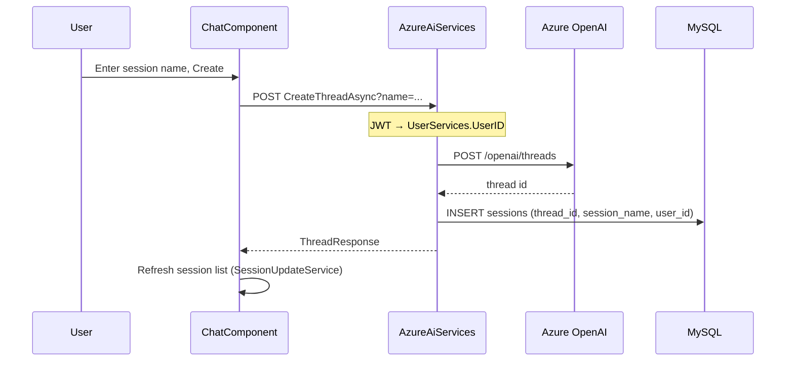
```mermaid
sequenceDiagram
    participant U as User
    participant FE as ChatComponent
    participant API as AzureAiServices
    participant Azure as Azure OpenAI
    participant DB as MySQL

    U->>FE: Enter session name, Create
    FE->>API: POST CreateThreadAsync?name=...
    Note over API: JWT → UserServices.UserID
    API->>Azure: POST /openai/threads
    Azure-->>API: thread id
    API->>DB: INSERT sessions (thread_id, session_name, user_id)
    API-->>FE: ThreadResponse
    FE->>FE: Refresh session list (SessionUpdateService)
```

### 8.3 Send Message & Receive AI Reply

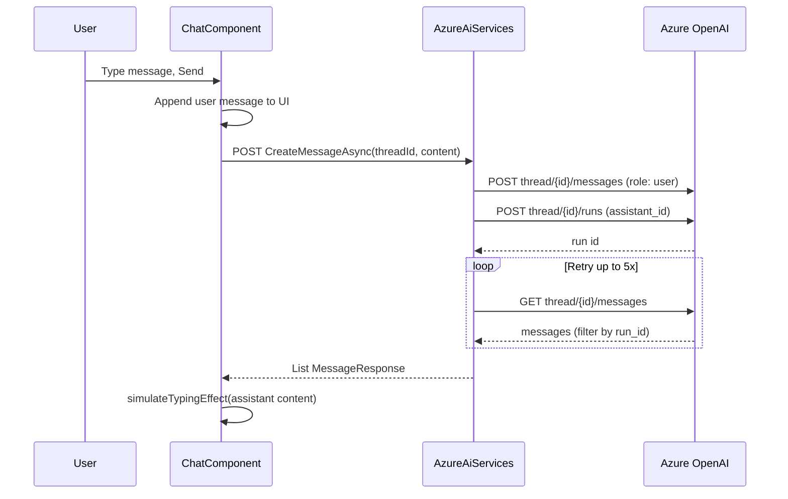
```mermaid
sequenceDiagram
    participant U as User
    participant FE as ChatComponent
    participant API as AzureAiServices
    participant Azure as Azure OpenAI

    U->>FE: Type message, Send
    FE->>FE: Append user message to UI
    FE->>API: POST CreateMessageAsync(threadId, content)
    API->>Azure: POST thread/{id}/messages (role: user)
    API->>Azure: POST thread/{id}/runs (assistant_id)
    Azure-->>API: run id
    loop Retry up to 5x
        API->>Azure: GET thread/{id}/messages
        Azure-->>API: messages (filter by run_id)
    end
    API-->>FE: List MessageResponse
    FE->>FE: simulateTypingEffect(assistant content)
```

### 8.4 Load Existing Session Messages

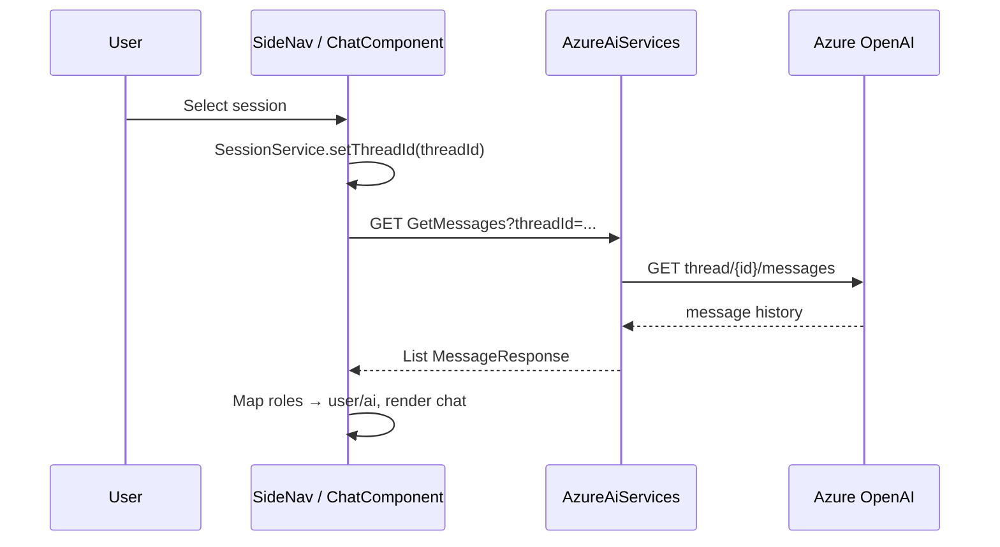
```mermaid
sequenceDiagram
    participant U as User
    participant FE as SideNav / ChatComponent
    participant API as AzureAiServices
    participant Azure as Azure OpenAI

    U->>FE: Select session
    FE->>FE: SessionService.setThreadId(threadId)
    FE->>API: GET GetMessages?threadId=...
    API->>Azure: GET thread/{id}/messages
    Azure-->>API: message history
    API-->>FE: List MessageResponse
    FE->>FE: Map roles → user/ai, render chat
```

---

## 9. Frontend Architecture

### 9.1 Route Map

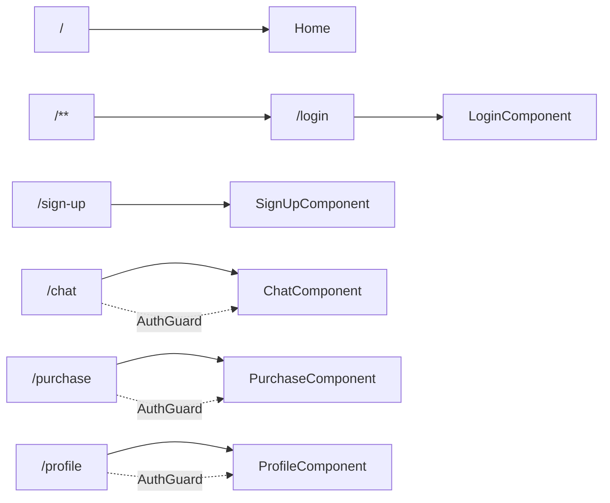
```mermaid
flowchart LR
    Root["/"] --> Home
    Login["/login"] --> LoginC[LoginComponent]
    SignUp["/sign-up"] --> SignUpC[SignUpComponent]
    Chat["/chat"] --> ChatC[ChatComponent]
    Purchase["/purchase"] --> PurchaseC[PurchaseComponent]
    Profile["/profile"] --> ProfileC[ProfileComponent]
    Wildcard["/**"] --> Login

    Chat -.->|AuthGuard| ChatC
    Purchase -.->|AuthGuard| PurchaseC
    Profile -.->|AuthGuard| ProfileC
```

| Path | Component | Guard | Purpose |
|------|-----------|-------|---------|
| `/` | Home | — | Landing, CTA to login/chat |
| `/login` | Login | — | Authentication |
| `/sign-up` | SignUp | — | Registration |
| `/chat` | Chat | AuthGuard | Main AI therapy interface |
| `/purchase` | Purchase | AuthGuard | Subscription / session purchase UI |
| `/profile` | Profile | AuthGuard | User profile |

### 9.2 State Management (Lightweight)

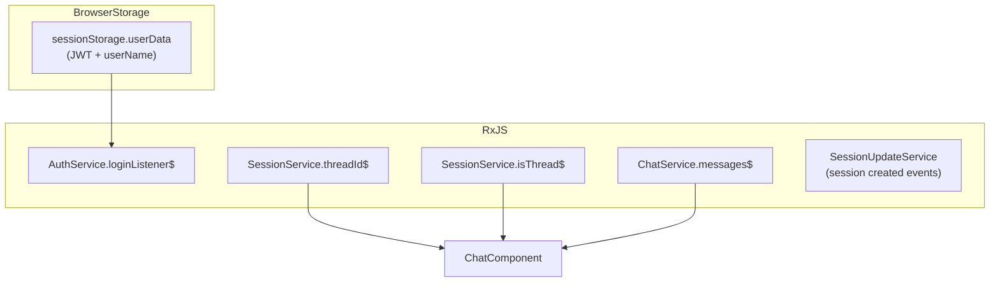
```mermaid
flowchart TB
    subgraph BrowserStorage
        SS["sessionStorage.userData<br/>(JWT + userName)"]
    end

    subgraph RxJS
        AuthB["AuthService.loginListener$"]
        ThreadB["SessionService.threadId$"]
        IsThreadB["SessionService.isThread$"]
        MsgB["ChatService.messages$"]
        SessionUpd["SessionUpdateService<br/>(session created events)"]
    end

    SS --> AuthB
    ThreadB --> ChatC[ChatComponent]
    IsThreadB --> ChatC
    MsgB --> ChatC
```

### 9.3 Chat UI Feature Map

| Feature | Implementation |
|---------|----------------|
| Session sidebar | `SideNavComponent` + `GetThreads` API |
| New session | `CreateSessionComponent` dialog / inline form |
| Message input | Contenteditable div, auto-resize |
| AI typing effect | `simulateTypingEffect()` character-by-character |
| Responsive nav | `BreakpointObserver` (mobile/tablet/desktop) |
| Toasts | `ToastService` + `CustomToastComponent` |

---

## 10. Backend Architecture

### 10.1 Service Layer

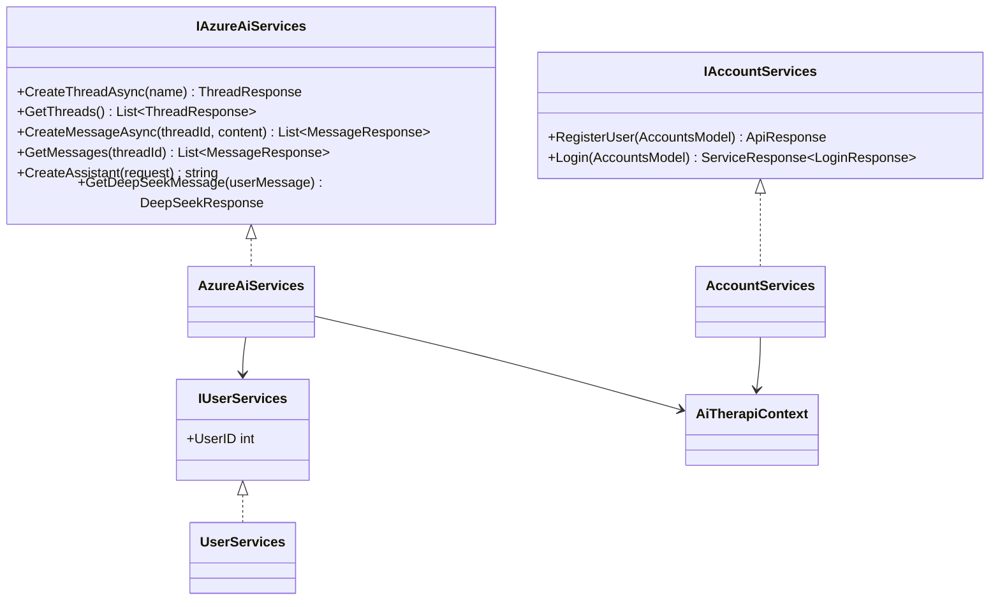
```mermaid
classDiagram
    class IAccountServices {
        +RegisterUser(AccountsModel) ApiResponse
        +Login(AccountsModel) ServiceResponse~LoginResponse~
    }

    class IUserServices {
        +UserID int
    }

    class IAzureAiServices {
        +CreateThreadAsync(name) ThreadResponse
        +GetThreads() List~ThreadResponse~
        +CreateMessageAsync(threadId, content) List~MessageResponse~
        +GetMessages(threadId) List~MessageResponse~
        +CreateAssistant(request) string
        +GetDeepSeekMessage(userMessage) DeepSeekResponse
    }

  IAccountServices <|.. AccountServices
  IUserServices <|.. UserServices
  IAzureAiServices <|.. AzureAiServices
  AzureAiServices --> IUserServices
  AzureAiServices --> AiTherapiContext
  AccountServices --> AiTherapiContext
```

### 10.2 Azure AI Orchestration Pipeline

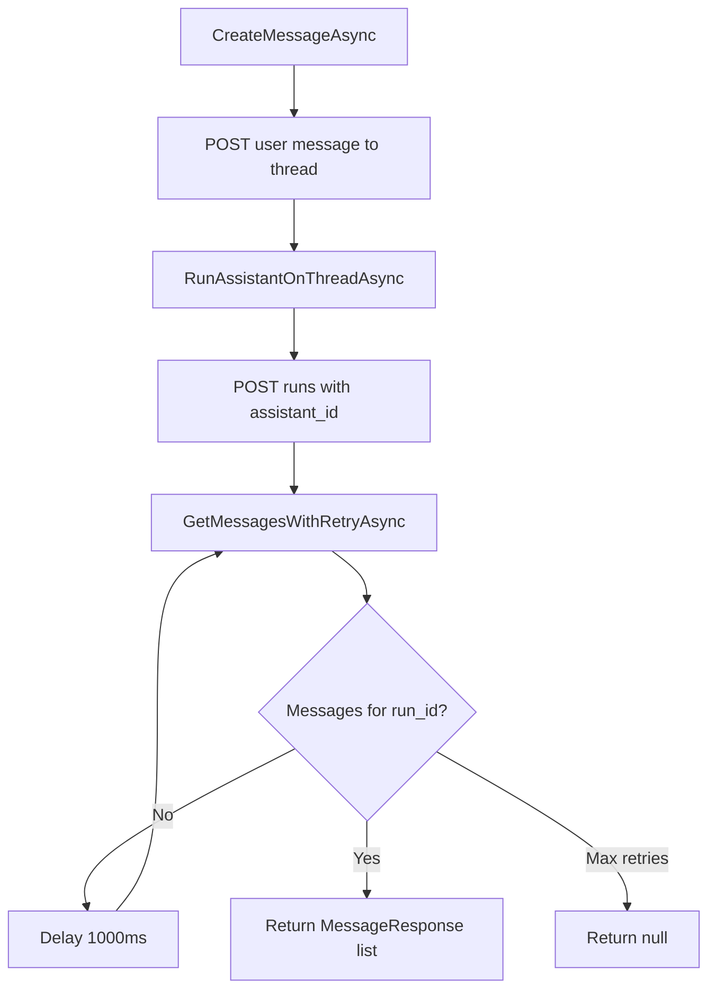
```mermaid
flowchart TD
    A[CreateMessageAsync] --> B[POST user message to thread]
    B --> C[RunAssistantOnThreadAsync]
    C --> D[POST runs with assistant_id]
    D --> E[GetMessagesWithRetryAsync]
    E --> F{Messages for run_id?}
    F -->|No| G[Delay 1000ms]
    G --> E
    F -->|Yes| H[Return MessageResponse list]
    F -->|Max retries| I[Return null]
```

**Hardcoded assistant ID** (in `AzureAiServices`): used for all therapy runs.

**Fallback greeting** (when `GetMessages` fails or is empty):

> *"Hello, welcome to THERAPi, your AI therapist. Do you wanna start by telling me more about yourself and what brings you here today?"*

### 10.3 Middleware Pipeline (`Program.cs`)

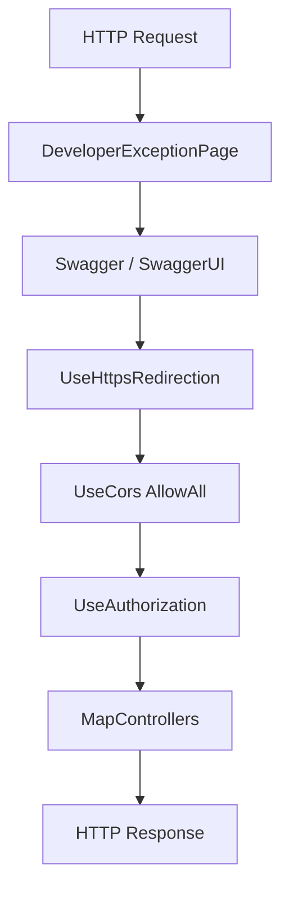
```mermaid
flowchart TD
    Req[HTTP Request] --> DevEx[DeveloperExceptionPage]
    DevEx --> Swagger[Swagger / SwaggerUI]
    Swagger --> HTTPS[UseHttpsRedirection]
    HTTPS --> CORS[UseCors AllowAll]
    CORS --> AuthZ[UseAuthorization]
    AuthZ --> Map[MapControllers]
    Map --> Res[HTTP Response]
```

> **Note:** `UseAuthentication()` is not explicitly called; JWT validation may not run unless configured elsewhere. Verify middleware order for production.

---

## 11. External Integrations

### 11.1 Integration Matrix

| Service | Protocol | Used For | Called From |
|---------|----------|----------|-------------|
| **Azure OpenAI** | REST (`api-key` header) | Threads, messages, runs, assistants, file upload | `AzureAiServices` |
| **DeepSeek** | REST (Bearer token) | Alternative chat completion | `AzureAiServices.GetDeepSeekMessage` |
| **MySQL** | TCP/3306 | Users, sessions | EF Core `AiTherapiContext` |

### 11.2 Azure OpenAI API Surface (Used)

| Operation | HTTP | Path Pattern |
|-----------|------|--------------|
| Create thread | POST | `{endpoint}/openai/threads?api-version=2024-08-01-preview` |
| List/get messages | GET | `{endpoint}/openai/threads/{threadId}/messages?api-version=...` |
| Create message | POST | `{endpoint}/openai/threads/{threadId}/messages?api-version=...` |
| Run assistant | POST | `{endpoint}/openai/threads/{threadId}/runs?api-version=...` |
| Create assistant | POST | `{endpoint}/openai/assistants?api-version=...` |
| Upload file | POST | `{endpoint}/openai/files?api-version=...` |

### 11.3 Integration Diagram

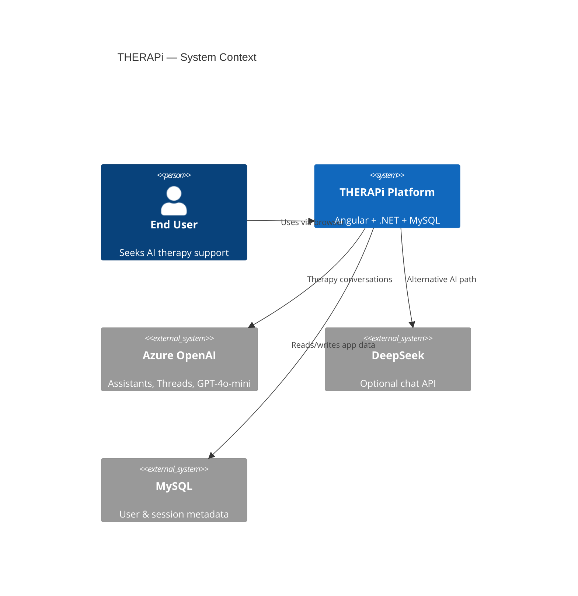
```mermaid
C4Context
    title THERAPi — System Context

    Person(user, "End User", "Seeks AI therapy support")

    System(therapi, "THERAPi Platform", "Angular + .NET + MySQL")

    System_Ext(azure, "Azure OpenAI", "Assistants, Threads, GPT-4o-mini")
    System_Ext(deepseek, "DeepSeek", "Optional chat API")
    System_Ext(mysql, "MySQL", "User & session metadata")

    Rel(user, therapi, "Uses via browser")
    Rel(therapi, azure, "Therapy conversations")
    Rel(therapi, deepseek, "Alternative AI path")
    Rel(therapi, mysql, "Reads/writes app data")
```

---

## 12. Technology Stack

### 12.1 Stack Summary Chart

| Tier | Technology | Version |
|------|------------|---------|
| **UI Framework** | Angular | 19.x |
| **UI Components** | Angular Material, Bootstrap | 19.x / 5.3 |
| **SSR** | Angular SSR + Express | 19.x |
| **API Client** | OpenAPI Generator (typescript-angular) | 2.15 |
| **Backend Runtime** | .NET | 8.0 |
| **ORM** | Entity Framework Core | 8.0.12 |
| **Database** | MySQL (Pomelo provider) | 8.0.2 |
| **Auth** | JWT Bearer | Microsoft.AspNetCore.Authentication.JwtBearer 8.0 |
| **API Docs** | Swagger (Swashbuckle) | 6.4 |
| **Serialization** | Newtonsoft.Json | 13.0 |
| **Container** | Docker | .NET 8 SDK + ASP.NET runtime |

### 12.2 Dependency Graph (Simplified)

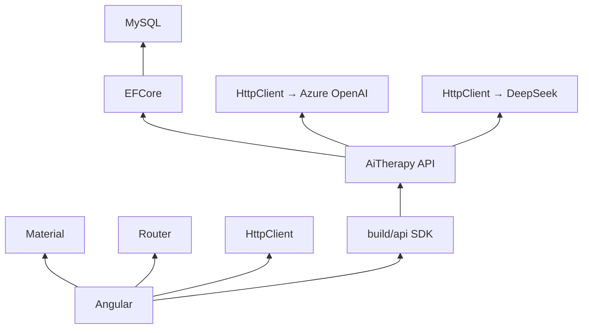
```mermaid
flowchart BT
    Angular --> Material
    Angular --> Router
    Angular --> HttpClient
    Angular --> OpenAPIClient["build/api SDK"]
    OpenAPIClient --> DotNetAPI["AiTherapy API"]
    DotNetAPI --> EFCore
    EFCore --> MySQL
    DotNetAPI --> AzureSDK["HttpClient → Azure OpenAI"]
    DotNetAPI --> DeepSeekHTTP["HttpClient → DeepSeek"]
```

---

## 13. Known Gaps & Future State

### 13.1 Current vs Target Architecture

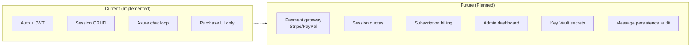
```mermaid
flowchart LR
    subgraph Current["Current (Implemented)"]
        C1[Auth + JWT]
        C2[Session CRUD]
        C3[Azure chat loop]
        C4[Purchase UI only]
    end

    subgraph Future["Future (Planned)"]
        F1[Payment gateway<br/>Stripe/PayPal]
        F2[Session quotas]
        F3[Subscription billing]
        F4[Admin dashboard]
        F5[Key Vault secrets]
        F6[Message persistence audit]
    end

    Current -.-> Future
```

### 13.2 Feature Completeness

| Feature | Status |
|---------|--------|
| User registration / login | ✅ Implemented |
| JWT-protected chat | ✅ Implemented |
| Azure thread per session | ✅ Implemented |
| Message send / AI reply | ✅ Implemented |
| Session sidebar | ✅ Implemented |
| Profile page | ⚠️ Partial (UI exists) |
| Purchase / redeem | ❌ UI only, no backend |
| Session limits (`sessionsLeft`) | ❌ Placeholder in UI |
| Payment webhooks | ❌ Not implemented |
| Admin / therapist roles | ❌ Only `User` role enum |
| Chat history in MySQL | ❌ Relies on Azure only |

### 13.3 Recommended Evolution

```mermaid
timeline
    title THERAPi Roadmap (Suggested)
    section Phase 1 — Hardening
        Move secrets to Key Vault : Security
        Fix auth middleware : JWT validation
        Restrict CORS : Production readiness
    section Phase 2 — Monetization
        Payment service : Stripe integration
        orders & subscriptions tables : MySQL
        Enforce session quotas : API middleware
    section Phase 3 — Scale
        Redis session cache : Performance
        Background jobs for AI polling : Reliability
        Observability (App Insights) : Operations
```

---

## Appendix A — OpenAPI Client Generation

The frontend regenerates its API client from the backend Swagger document:

```bash
# From Therapi FrontEnd/package.json
openapi-generator-cli generate \
  -g typescript-angular \
  -i <SWAGGER_URL>/swagger/v1/swagger.json \
  -o ./build/api
```

This produces `AzureAiService`, `AccountsService`, models, and `Configuration` used in `app.config.ts`.

---

## Appendix B — Glossary

| Term | Definition |
|------|------------|
| **Thread** | Azure OpenAI conversation container; maps 1:1 to app `sessions` row |
| **Run** | Execution of an Assistant against a Thread after a user message |
| **Assistant** | Pre-configured AI persona with instructions and tools |
| **Session** | User-facing label for a therapy chat (DB record + Azure thread) |

---

*Document generated for the THERAPi (Main Therapi App) codebase. Diagrams use [Mermaid](https://mermaid.js.org/) syntax and render in GitHub, GitLab, VS Code, and most modern Markdown viewers.*
